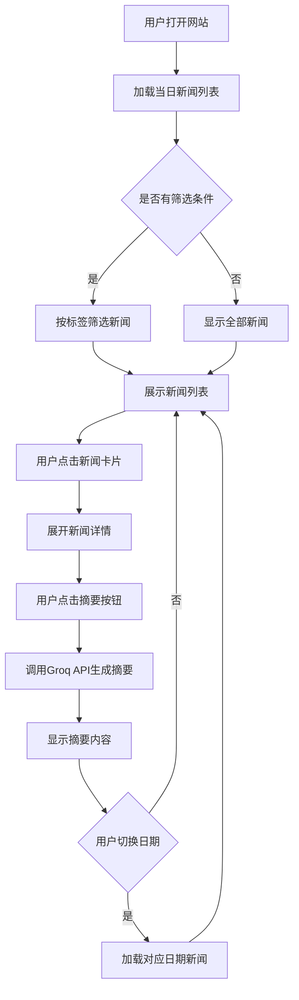

# LiveNews AI - 产品需求文档

## 1. 产品概述

一款面向全公司的每日AI新闻网站，帮助员工快速了解AI领域最新动态。

**核心价值**：解决AI信息过载问题，通过精选内容、中英对照、智能摘要，让每个人都能轻松获取有价值的AI资讯。

**目标用户**：公司全体员工，无需AI背景知识

---

## 2. 核心功能

### 2.1 功能模块

1. **首页新闻列表**
   - 每日精选10-20条高质量AI新闻
   - 左半边显示英文原文，右半边显示中文翻译
   - 支持按分类标签筛选
   - 支持查看7天内每天的历史新闻

2. **分类标签系统**
   - 🔴 AI芯片动态：芯片、GPU、算力相关
   - 🟢 工具推荐：可立即使用的AI工具和软件
   - 🔵 行业动态：行业趋势、投融资、公司动态
   - 🟣 学术精选：前沿论文和研究成果（带通俗解读）

3. **智能摘要功能**
   - 每条新闻右侧有"摘要"按钮
   - 点击后生成简短摘要（2-3句话）
   - 描述核心要点，不长篇大论

4. **真实性验证标记**
   - S级+多源验证的新闻占比≥80%
   - 标记说明：
     - 🟢 极高可信度（S级源）
     - 🟡 高可信度（A级源）
     - 🟠 需自行判断（B级源）
     - ✅ 多源验证
     - ⚠️ AI辅助标记（预印本/性能声明/观点声明）

5. **历史新闻查看**
   - 顶部日期选择器
   - 支持左右箭头切换日期
   - 保留7天历史数据

---

## 3. 数据源

### 英文源
| 来源 | 类型 | 内容占比 |
|------|------|---------|
| Hacker News | 新闻+讨论 | 30% |
| TechCrunch | 科技媒体 | 15% |
| The Verge | 科技媒体 | 15% |
| ArXiv | 学术论文 | 20% |
| Reddit | 社区讨论 | 10% |
| Product Hunt | 产品发现 | 10% |

### 中文源
| 来源 | 类型 | 内容占比 |
|------|------|---------|
| 机器之心 | AI垂直媒体 | 40% |
| 量子位 | AI垂直媒体 | 35% |
| 36氪 | 科技媒体 | 25% |

### 内容比例
- 70% 行业型内容
- 30% 学术型内容（带通俗中文解读）

---

## 4. 用户界面设计

### 4.1 设计风格

**设计理念**：科技感 + 专业感 + 易读性

**配色方案**：
- 主色调：深蓝色 #1a1a2e（科技感）
- 次要色：浅灰色 #f5f5f5（背景）
- 强调色：橙色 #ff6b35（交互元素）
- 分类标签色：
  - 🔴 AI芯片：#e74c3c
  - 🟢 工具推荐：#27ae60
  - 🔵 行业动态：#3498db
  - 🟣 学术精选：#9b59b6

**字体**：
- 标题：思源黑体 / Noto Sans SC
- 正文：Inter / 思源黑体

**布局**：
- 桌面端优先
- 左右分栏布局（原文50% | 译文50%）
- 卡片式新闻列表
- 固定顶部导航+日期选择器

### 4.2 页面结构

```
┌─────────────────────────────────────────────────────┐
│  Logo + 标题    │    日期选择器（7天）    │  筛选按钮  │
├─────────────────────────────────────────────────────┤
│  分类标签筛选: [全部] [🔴AI芯片] [🟢工具] [🔵动态] [🟣学术] │
├─────────────────────────────────────────────────────┤
│  ┌─────────────────────────────────────────────────┐│
│  │ 分类标签  │ 真实性标记  │    日期    │  来源网站   ││
│  ├─────────────────────────────────────────────────┤│
│  │ 左侧：英文原文    │  右侧：中文译文    │ [摘要] ││
│  │ 50%           │  50%           │      ││
│  └─────────────────────────────────────────────────┘│
│  ┌─────────────────────────────────────────────────┐│
│  │ ...下一条新闻...                                 ││
│  └─────────────────────────────────────────────────┘│
└─────────────────────────────────────────────────────┘
```

### 4.3 响应式设计

- **桌面端（≥1024px）**：左右分栏布局
- **平板端（768-1024px）**：保持左右分栏，间距缩小
- **移动端（<768px）**：切换为上下布局（原文在上，译文在下）

---

## 5. 核心流程



---

## 6. 技术约束

- **完全免费**：所有服务不产生费用
- **零门槛**：打开网址即可使用，无需安装
- **公开访问**：无需登录，面向所有用户
- **响应速度**：页面加载<3秒，摘要生成<5秒
