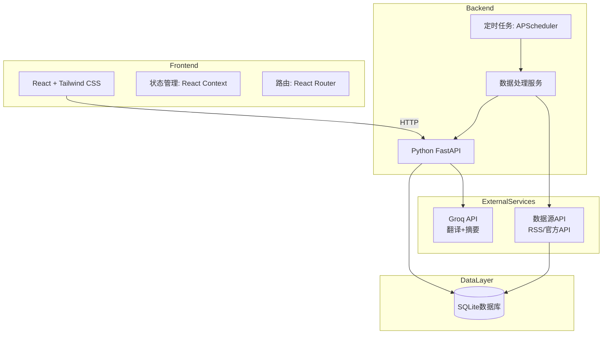
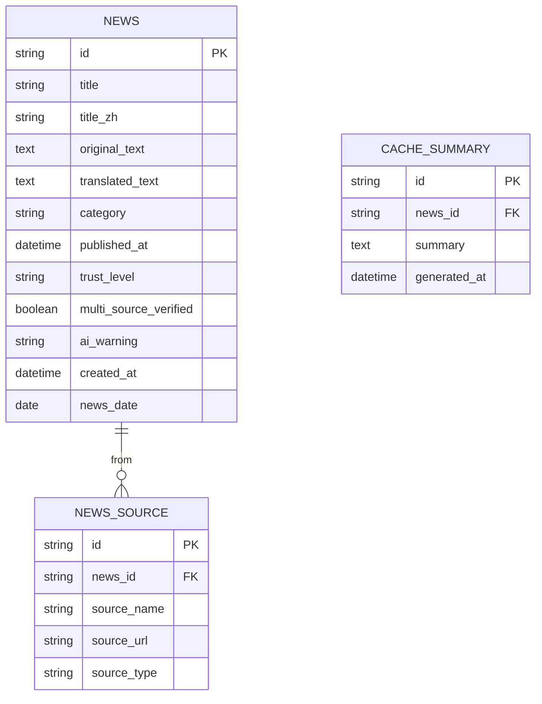
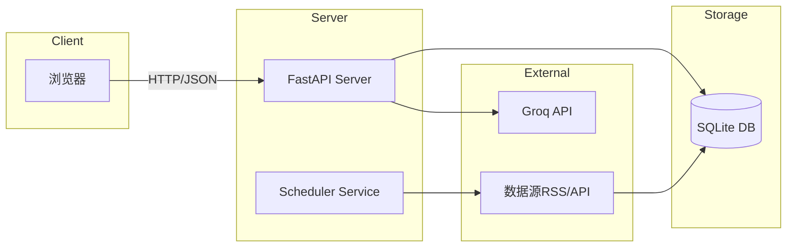

# LiveNews AI - 技术架构文档

## 1. 系统架构



## 2. 技术栈

| 层级 | 技术选型 | 说明 |
|------|---------|------|
| **前端** | React 18 + Vite | 快速构建，现代响应式UI |
| **样式** | Tailwind CSS | 原子化CSS，快速开发 |
| **后端** | Python FastAPI | 高性能API框架 |
| **数据库** | SQLite | 轻量级，满足V1需求 |
| **定时任务** | APScheduler | Python原生定时任务 |
| **外部API** | Groq API | 免费Llama模型（翻译+摘要） |
| **数据获取** | requests + feedparser | RSS订阅+官方API |

## 3. 路由定义

| 路由 | 方法 | 说明 |
|------|------|------|
| `/` | GET | 首页，显示当日新闻列表 |
| `/api/news` | GET | 获取新闻列表（支持日期、分类参数） |
| `/api/news/{id}/summary` | POST | 生成单条新闻摘要 |
| `/api/categories` | GET | 获取分类列表 |

## 4. API 定义

### 4.1 获取新闻列表

**请求**：
```
GET /api/news?date=2024-01-15&category=all
```

**响应**：
```json
{
  "success": true,
  "data": {
    "date": "2024-01-15",
    "news": [
      {
        "id": "uuid",
        "title": "News Title",
        "title_zh": "新闻标题",
        "original_text": "Full article text...",
        "translated_text": "翻译后的全文...",
        "category": "chip",
        "category_label": "AI芯片动态",
        "category_emoji": "🔴",
        "source": "TechCrunch",
        "source_url": "https://...",
        "published_at": "2024-01-15T10:00:00Z",
        "trust_level": "S",
        "multi_source_verified": true,
        "ai_warning": null
      }
    ],
    "categories": [
      {"value": "all", "label": "全部", "emoji": "📋"},
      {"value": "chip", "label": "AI芯片", "emoji": "🔴"},
      {"value": "tool", "label": "工具推荐", "emoji": "🟢"},
      {"value": "industry", "label": "行业动态", "emoji": "🔵"},
      {"value": "academic", "label": "学术精选", "emoji": "🟣"}
    ]
  }
}
```

### 4.2 生成摘要

**请求**：
```
POST /api/news/{id}/summary
```

**响应**：
```json
{
  "success": true,
  "data": {
    "news_id": "uuid",
    "summary": "🎯 核心要点：xxx\n📌 关键细节：1. xxx 2. xxx\n💡 为什么重要：xxx",
    "generated_at": "2024-01-15T12:00:00Z"
  }
}
```

## 5. 数据模型

### 5.1 ER 图



### 5.2 数据定义语言

```sql
CREATE TABLE news (
    id TEXT PRIMARY KEY,
    title TEXT NOT NULL,
    title_zh TEXT,
    original_text TEXT NOT NULL,
    translated_text TEXT,
    category TEXT CHECK(category IN ('chip', 'tool', 'industry', 'academic')),
    published_at DATETIME,
    trust_level TEXT CHECK(trust_level IN ('S', 'A', 'B')),
    multi_source_verified BOOLEAN DEFAULT FALSE,
    ai_warning TEXT,
    created_at DATETIME DEFAULT CURRENT_TIMESTAMP,
    news_date DATE NOT NULL,
    summary_cache TEXT
);

CREATE INDEX idx_news_date ON news(news_date);
CREATE INDEX idx_news_category ON news(category);

CREATE TABLE news_sources (
    id TEXT PRIMARY KEY,
    news_id TEXT REFERENCES news(id),
    source_name TEXT,
    source_url TEXT,
    source_type TEXT
);

CREATE TABLE cache_summary (
    id TEXT PRIMARY KEY,
    news_id TEXT REFERENCES news(id),
    summary TEXT,
    generated_at DATETIME DEFAULT CURRENT_TIMESTAMP
);
```

## 6. 服务器架构



### 定时任务流程

| 时间 | 任务 | 说明 |
|------|------|------|
| 每日 06:00 | 抓取全部数据源 | 更新新闻数据库 |
| 每日 06:30 | 翻译全部新闻 | 调用Groq API |
| 每日 07:00 | 生成摘要缓存 | 预生成当日热门新闻摘要 |
| 每日 07:30 | 清理过期数据 | 删除7天前数据 |

## 7. 部署方案

| 组件 | 平台 | 费用 |
|------|------|------|
| 前端 | Vercel | 免费 |
| 后端API | Railway / Render | 免费额度 |
| 数据库 | SQLite (文件系统) | 免费 |

## 8. 目录结构

```
livenews-ai/
├── frontend/
│   ├── src/
│   │   ├── components/
│   │   │   ├── Header.tsx
│   │   │   ├── DateSelector.tsx
│   │   │   ├── CategoryFilter.tsx
│   │   │   ├── NewsCard.tsx
│   │   │   ├── NewsList.tsx
│   │   │   ├── SummaryButton.tsx
│   │   │   └── TrustBadge.tsx
│   │   ├── hooks/
│   │   │   ├── useNews.ts
│   │   │   └── useSummary.ts
│   │   ├── services/
│   │   │   └── api.ts
│   │   ├── types/
│   │   │   └── news.ts
│   │   ├── App.tsx
│   │   ├── main.tsx
│   │   └── index.css
│   ├── index.html
│   ├── package.json
│   ├── vite.config.ts
│   └── tailwind.config.js
├── backend/
│   ├── app/
│   │   ├── main.py
│   │   ├── routers/
│   │   │   └── news.py
│   │   ├── services/
│   │   │   ├── scraper.py
│   │   │   ├── translator.py
│   │   │   ├── summarizer.py
│   │   │   └── verifier.py
│   │   ├── models/
│   │   │   └── news.py
│   │   └── database/
│   │       └── db.py
│   ├── scheduler/
│   │   └── tasks.py
│   ├── requirements.txt
│   └── run.py
└── README.md
```
